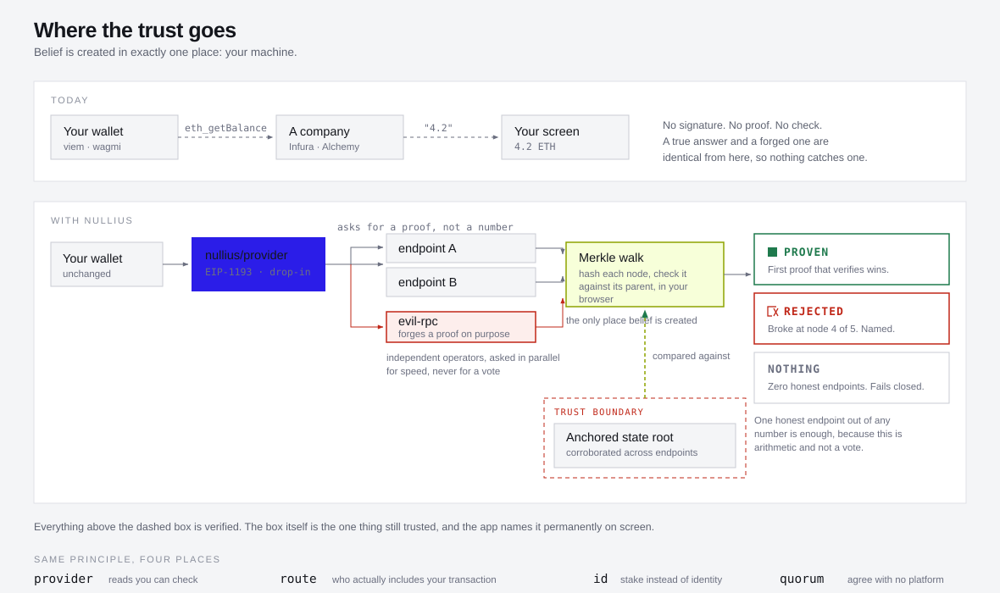

# Nullius

**Your wallet has never once checked. Nullius makes it check.**

Nullius is a verifying read path for Ethereum. Instead of asking a server for your balance and believing the answer, it asks for a cryptographic proof and checks that proof in your browser. When a server lies, you see it happen, and you see the exact place the lie broke.

---

## Why you would want this

**You can stop trusting the company that answers your wallet's questions.** Right now, every balance, token holding, and contract value you see arrived as a sentence from Infura or Alchemy or whichever endpoint is configured, with no signature and no check anywhere in the path. Nullius turns those into values you can verify yourself. One honest endpoint out of any number is enough.

**You can tell when an endpoint is lying to you.** Today there is no way to know. A lying server looks identical to an honest one, because there is no error and no warning, and your wallet draws the lie in the same font as the truth. Nullius rejects proofs that do not hash to the root and names the node where each one failed.

**You can find out which endpoints are actually trustworthy.** Some popular public endpoints refuse to serve proofs at all. During this build both `publicnode` and `merkle.io` either refused or throttled the request. Nullius records who serves proofs, who serves garbage, and who does not answer.

**You can see whether your transaction can actually get through.** Most Ethereum validators no longer build their own blocks. Builders and relays do, and some relays filter what they will carry. Nullius reads the relays' own public feeds, counts what each one delivered over a window they can all see, and shows you the share of Ethereum's block supply flowing through relays that filter. Then it broadcasts one signed transaction across several routes at once and records which route went quiet, so silent censorship becomes something you can watch instead of something you guess at.

**You can prove you belong to a group without identifying yourself.** Most anti Sybil defences want a passport, a phone number, or a face scan. Nullius gates membership on proven ETH holdings, so an extra identity costs real capital instead of real privacy, and there is no registry anywhere to be leaked or captured.

**You can drop it into an app you already have.** It implements EIP-1193, the standard interface every Ethereum library already speaks, so viem, wagmi and ethers can accept it without the app being rewritten.

---

## See it in a minute

```bash
pnpm install
EVIL_UPSTREAM=https://eth.drpc.org pnpm evil    # the dishonest endpoint
pnpm dev                                         # the app
```

| Open this | To see |
|---|---|
| `http://localhost:5180/pitch.html` | a live verification against real mainnet, in the first screen |
| `http://localhost:5180/?show=rejected` | a forged proof, rejected at the node where it broke |
| `http://localhost:5180/` | the full console |

Ask the dishonest endpoint what it faked:

```bash
curl http://127.0.0.1:8546/tampering
```

---

## The problem, stated plainly

When your wallet shows you a balance, that number came from a company.

Your wallet asked a server how much ETH an address holds. The server answered. Your wallet drew the answer on the screen. That is the whole exchange. No signature, no proof, no check. The number is a claim, and your wallet believes it the way you believe a stranger who tells you the time.

Three things make that worse than it sounds. A very large share of all Ethereum reads flow through a handful of companies, so one of them returning wrong data means millions of wallets show wrong data and nothing notices. A lying server is invisible, because nothing in the normal read path can tell the difference. And if an attacker can make your wallet believe a false balance or a false allowance, they can walk you into signing something you never would have signed.

The useful part: Ethereum already solved this in 2018, and almost nobody uses the solution.

---

## How it works

Every Ethereum block header contains a **state root**. That is a single hash which fingerprints every account on Ethereum at once, because each node in Ethereum's account tree is identified by a hash of its contents and every parent holds the identities of its children. Change one balance anywhere and the state root changes.

Because of how that tree is built, a server can prove one account's contents without sending you the whole tree. It sends the path: the handful of nodes running from the top down to your account, plus the sibling hashes along the way.

Then you do the work. Hash the account data, check that hash appears in its parent, hash the parent, check that appears in its parent, and walk all the way up. Compare what you computed against a state root you already trust. If they match, the data is genuine in the same way that two plus two is four. If they do not, the server lied. Forging it would mean breaking the hash function.

Ethereum exposes this as `eth_getProof`, standardised as EIP-1186. Any node can serve it.

### Why not just ask five servers and take the majority?

Because a vote is weaker than a proof, and this is the design decision the whole project rests on.

Many "different" endpoints are resold access to the same few backends, so polling five sources often means polling one source five times. They can be wrong together, since one bug in a popular client version or one legal order covering several companies moves the majority in a single step. And a majority of five means an attacker needs to corrupt three, which is a price rather than a barrier.

| | Polling providers | Verifying a proof |
|---|---|---|
| Honest sources needed | a majority | exactly one |
| If every source lies | you are deceived, silently | you get nothing, loudly |
| The attacker's job | corrupt the majority | break keccak256 |
| Can you detect a lie? | only from the minority | always, and name the node |

With proofs you need one honest provider out of any number, because you are checking arithmetic rather than counting opinions. With zero honest providers you are not deceived, you get nothing, and the interface tells you so.

Liveness degrades. Safety does not.

---

## The architecture



The diagram compares two read paths. Here is how to read it.

### The top band: what happens today

Three boxes in a row, joined by dashed arrows. Your wallet asks a provider using `eth_getBalance`, the provider replies with the string `"4.2"`, and your screen displays `4.2 ETH`.

The arrows are dashed on purpose. Nothing in that path carries any evidence. As the note beside it says, a truthful answer and a forged one are byte identical from your wallet's point of view, which is why no wallet has ever caught one.

### The bottom band: what Nullius does instead

Reading left to right:

**Your wallet, unchanged.** It keeps speaking the same standard interface. Nothing about the app has to be rewritten.

**`nullius/provider`,** the ultramarine box. This is the piece that replaces the ordinary connection. It quietly upgrades the question from "what is the balance" to "prove the balance".

**Three endpoints, fanned out.** Two independent operators and, in the demo, `evil-rpc`, outlined in red because it lies on purpose. All three are asked at the same time. The important thing is why: they are asked in parallel for speed and liveness, **not** so a vote can be held between them.

**The local Merkle walk,** outlined in citron. Every returned proof lands here. Each node is hashed and checked against the reference its parent holds, in your browser, not on any server. This is the only place in the whole diagram where belief is created.

**The trust boundary,** the dashed red box at the bottom. Inside it sits the anchored state root, which is the one thing still being trusted. The citron arrow running up from it into the verifier shows what every proof is compared against. Everything above that box is verified. That box itself is an assumption, and the app names it permanently on screen rather than hiding it in a footnote.

**Three outcomes,** on the right:

- **Proven.** The first proof that verifies wins. One honest endpoint is enough.
- **Rejected.** A proof was offered and its chain of hashes does not reach the root. It broke at node 4 of 5, and the interface says so, because naming the node is more useful than saying verification failed.
- **Zero honest.** You get nothing, not a lie.

**The strip along the bottom** lists the four modules, which are the same principle applied in four places: reads you can check, who actually includes your transaction, stake instead of identity, and agreeing without a platform.

### The one sentence version

Belief is created in exactly one place, on your machine, by comparing hashes against a root you obtained independently. Everything else is plumbing, and every value carries a label saying which of those it is.

---

## Four levels of trust

Every value in the interface carries one of these. They use four drawn shapes rather than four colours, so the difference survives a black and white screenshot, because a trust level you cannot tell apart is a trust level the interface failed to communicate.

| Level | Meaning |
|---|---|
| **Proven** | Merkle verified against the anchored state root. Genuine as arithmetic. |
| **Attested** | Endpoints agree, and no proof was offered. Agreement is not proof. |
| **Unverifiable** | One source, no proof obtainable. This is a claim. |
| **Rejected** | A proof was offered and its chain of hashes does not reach the root. |

There is also a bar across the top of the app listing everything the system does not prove, permanently. A system that catches a server lying only earns belief if it is equally precise about its own limits.

---

## The four modules

**provider** is the verifying read path. It anchors a state root, upgrades reads into `eth_getProof`, and walks the Merkle Patricia path locally. It refuses endpoints that answer for the wrong chain, and it chooses the anchor block as the highest block at least two independent endpoints claim to have, so no single endpoint can pick our root by misreporting its height.

**route** is the censorship radar and the flight recorder. It measures relay behaviour from the relays' own public feeds and multicasts one signed transaction across several routes so you can see which one went silent.

**id** is a Noir circuit for anonymous membership. It proves you know a secret whose commitment sits in a published tree, and that your nullifier came from that same secret, without revealing which member you are. 481 gates, and the proof verifies.

**quorum** is group signalling gated on proven holdings rather than identity.

**evil-rpc** is a deliberately dishonest endpoint, shipped as a first class part of the project rather than as a test fixture. It reports balances a hundred times too large and corrupts one node of every account proof. The argument this project makes is untestable until you can point at a liar and watch it get caught, so we ship the liar.

Note what it cannot do. It cannot produce a proof that verifies while carrying a false balance, because that would mean breaking keccak256. That asymmetry is the entire idea.

---

## Repository layout

```
packages/types      the frozen interface contract, everything codes against this
packages/provider   state root anchoring, eth_getProof, and the Merkle verifier
packages/route      censorship radar, multicast sender, flight recorder
packages/id         the Noir circuit and its proving scripts
apps/web            the console and the project page
apps/evil-rpc       the deliberately dishonest endpoint
```

`packages/provider/src/mpt.ts` is the file the project rests on. Everything else is arrangement, and it is written to be read.

---

## Running it fully

Needs Node 20 or newer and pnpm. The read path talks to two independent public mainnet endpoints plus the dishonest one, so the proofs are real mainnet proofs and the root is corroborated across operators who do not share a backend. Relay data APIs send no CORS headers, so the dev server proxies them.

For the flight recorder's send path, which needs a funded account, also run:

```bash
anvil --fork-url https://eth.drpc.org --port 8545 --chain-id 1
```

Endpoints are overridable with a `.env` file in `apps/web`.

| Variable | Default | Role |
|---|---|---|
| `VITE_RPC_A` | `https://eth-mainnet.public.blastapi.io` | honest |
| `VITE_RPC_B` | `https://gateway.tenderly.co/public/mainnet` | honest |
| `VITE_EVIL_RPC` | `http://127.0.0.1:8546` | the dishonest one |
| `VITE_FORK_RPC` | `http://127.0.0.1:8545` | send path only |

### The circuit

Needs `nargo` and `bb`, installed through `noirup` and `bbup`.

```bash
pnpm --filter @nullius/id all
```

That runs the tests, compiles, solves the witness, writes a verification key, produces a proof, and verifies it. 3 tests pass, 2 of them negative, at 481 gates and 29 ACIR opcodes, producing a 14,656 byte UltraHonk proof.

The negative tests are the interesting ones. One shows a path to a root nobody can produce is refused, the other shows a nullifier not derived from the secret is refused. A circuit that only passes its happy path has demonstrated nothing. You can also flip a byte of `target/public_inputs` and watch verification fail.

---

## What we do not prove

This is the most useful section here, and all of it is on screen in the app too.

**The anchor.** The root comes from a header corroborated across independent endpoints, not from a verified sync committee signature. That is a larger assumption than running a light client, not a smaller one, because these are third parties. It is the biggest thing being trusted.

**`eth_call`.** A contract call is a computation rather than a lookup, so no single leaf holds the answer. Verifying it properly means fetching proofs for every storage slot the call touches and re executing the code locally. Implemented for one path to show the technique works. Everything else is marked unverifiable.

**Gas estimates and event logs.** No proof is wired for either. Receipt trie proofs can verify logs, and that is the next step.

**Transaction inclusion.** The flight recorder's inclusion is reported rather than proven. Proving it means rebuilding the block's transaction tree locally and checking its root against the header.

**Censorship intent.** We measure behaviour. "This relay has not included this kind of transaction" is a measurement. Why it did that is an inference, and we do not present inference as data.

**Personhood.** The id module proves capital, not humanity. It raises the cost per identity rather than capping identities, which is the right trade for some uses and the wrong one for others.

**Zero knowledge membership in the app.** The quorum's gate is proven, because every member's balance was demonstrated against the same root. Its anonymity is not proven inside the app: the circuit exists and verifies, but it proves through the command line rather than in your browser, and the set it proves membership of is a snapshot rather than the live state tree.

**Collusion resistance.** We have anonymity, which is a different property. Anonymity from the public does not stop someone voluntarily showing a briber how they voted. Stopping that needs receipt freeness, which needs the ability to secretly replace your key. That is MACI's contribution, and we cite it rather than claiming to have rebuilt it.

---

## Known gaps

The circuit proves through the command line rather than in the browser. Wiring it in needs a JavaScript implementation of the circuit's exact hash construction, because Noir 1.0 exposes only `poseidon2_permutation` and no library reproduces that sponge off the shelf.

The web bundle is a single chunk of roughly one megabyte, with no code splitting.

Two bloXroute relay feeds fail from some networks. Their rows render with their errors rather than being hidden, because an empty table would read as "nothing is happening", which is a claim we have not earned.

Measuring inclusion delay properly needs first seen timestamps per transaction across a longer window than one session collects, which is why that column states it cannot be derived rather than showing a number we could not defend.

---

## Other documents

| File | What is in it |
|---|---|
| `EXPLAINER.md` | the whole system in plain words, with a glossary and the hard questions answered |
| `DEVFOLIO.md` | the submission content |
| `IDEAS.md` | the strategy, the alternatives considered, and the risk register |
| `PRODUCT.md` | durable product truth |
| `DESIGN.md` | the visual system, recorded from the built code |
| `packages/id/README.md` | what the circuit proves and what it does not |

---

*The name is from* nullius in verba, *Latin for "take nobody's word for it", the motto the Royal Society adopted in 1660.*
